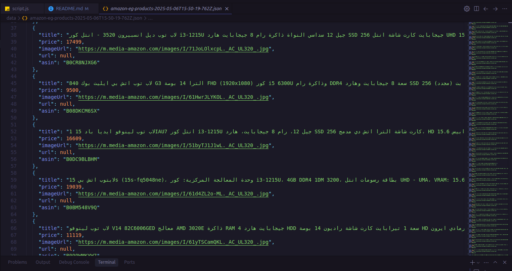

# 🔍 SearchOnAmazon - Amazon Product Search 



> "Quickly search and discover Amazon products with real-time results. Built for speed and simplicity."

---


> *Note: API key required for full functionality. Demo uses mock data for preview.*

---


## 🔧 Quick Start (Local Setup)

### Prerequisites
- Node.js 18+
- Amazon PA-API credentials (get from [Amazon Associates](https://affiliate-program.amazon.com/))

### Installation

```bash
# Clone the repo
git clone https://github.com/0Kareem0/SearchOnAmazon.git
cd SearchOnAmazon

# Install dependencies
npm install

# Add your API keys to .env
echo "AMAZON_ACCESS_KEY=your_access_key" >> .env
echo "AMAZON_SECRET_KEY=your_secret_key" >> .env
echo "AMAZON_ASSOCIATE_TAG=your_tag" >> .env

# Start dev server
npm run dev
